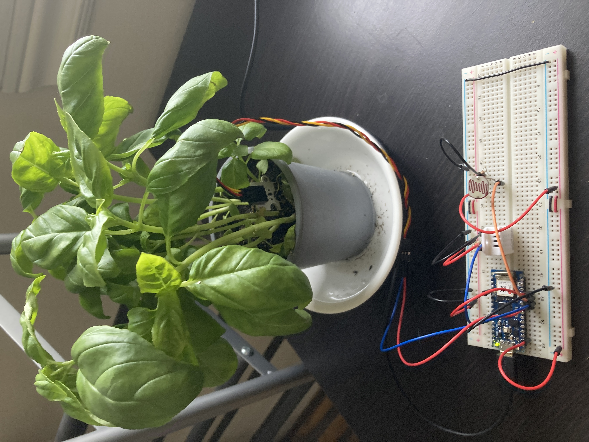
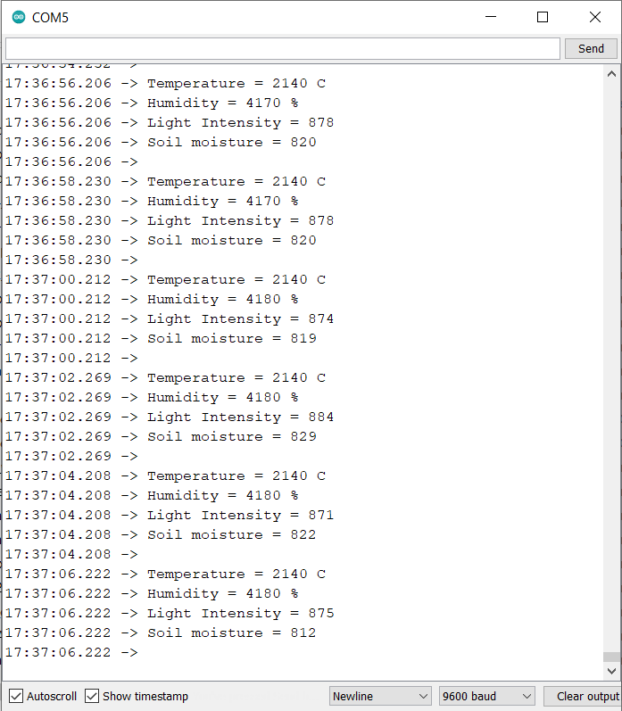
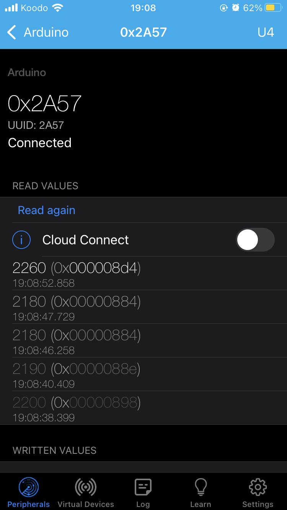

# Mirabilis - Giving everyone a green thumb

## Table of Content:

- [Project Status](#Project-Status)
- [Project Overview](#Project-Overview)
- [Features](#Features)
- [Photos/Screenshots](#Photos/Screenshots)
- [Technologies](#Technologies)
- [Acknowledgments](#Acknowledgments)
- [License](#License)

## Project Status:
Mirabilis is currently in the early development stage. A working prototype for the hardware part of the solution has been developed, which can record data and send it periodically over a Bluetooth Low Energy service. The data can be read using an app like LightBlue and can also be sent to a connected computer over Serial.

The next steps for the project include adding a solar cell and battery to make the sensor wireless and implementing a prototype of the mobile app to receive and display the data from the plant sensor.

## Project Overview:
Mirabilis is a smart plant care system designed to help everyone develop a green thumb. It consists of a physical connected sensor that collects data from various environmental sensors such as air temperature, air humidity, sunlight intensity, and soil moisture. The sensor sends this information to a mobile app on the user's phone, which compiles and presents the data in an easy-to-understand format.

## Features:
- **Environmental Sensors:** Mirabilis includes a range of sensors such as air temperature, air humidity, sunlight intensity, and soil moisture sensors, to gather data on the plant's surroundings.
- **Real-Time Monitoring:** With Mirabilis, users can monitor the health of their plants in real-time, ensuring they catch any issues before they become a bigger problem.
- **Guidance on Plant Care:** The app will provide guidance on how to best care for the plant based on the data collected by the sensor, helping users take care of their plants more effectively.

## Photos/Screenshots:

## Technologies:
- Arduino
- BLE
- LightBlue
- KiCAD

## Acknowledgments:
- Reading data from the DHT22 using [DHTlib library](https://github.com/RobTillaart/DHTlib) by Rob Tillaart 
- Using the onboard BLE module using [ArduinoBLE library](https://github.com/arduino-libraries/ArduinoBLE) with guidance from this [tutorial](https://docs.arduino.cc/tutorials/nano-33-iot/bluetooth) by Arduino

## License:
MIT license @ziedmasmoudi